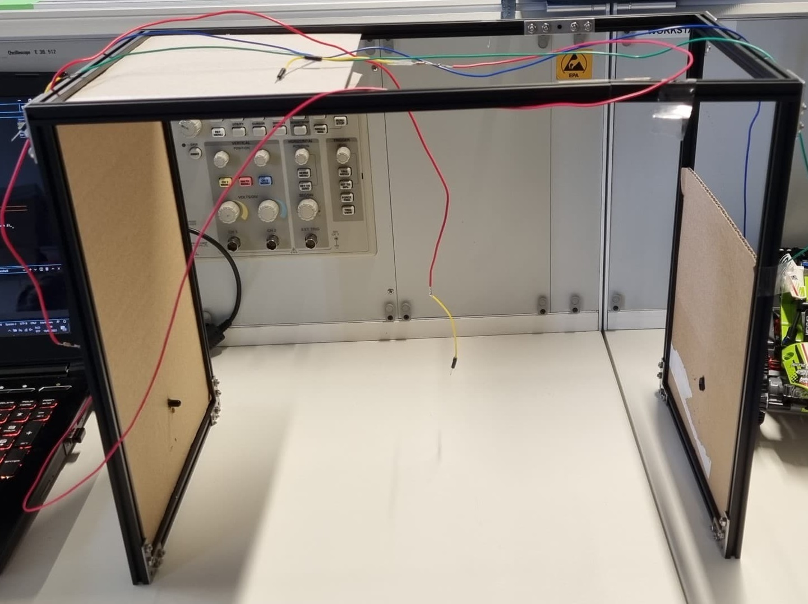

# PROJECTS – LEGO BATTLE TANKS

## Goal

- Control the Lego RC Tanks using the S-Brick via Bluetooth
- Race against other teams
- ( make noise when you have driven through heckpoint.)

## Current progress

webpage with:
- controls & scoreboard

- live POV feed from ESP32 camera

- assembled starting checkpoint

## How it works
We mounted a ESP32 camera onto the car which sets up a server that streams the live feed. The data then goes to the central webserver 
which displays the feed to the user and sends inputs to the S-brick through bluetooth. We also have the start/finish that sends a signal when the something passes through it, 
this sends a signal using the mqtt protocol using mosquito.

## Materials

- Lego RC Tank
- Controlled via S-Brick (Bluetooth)
- Using arduino LCD to measure speed.
- NFC: to activate checkpoints.
- Using light sensor for start/stop

## Members

- Aaron Degroote
- Mark De Craemere
- Matias Vereecke
- Arthur Coupé

## Extra's

- a gun to shoot targets.
