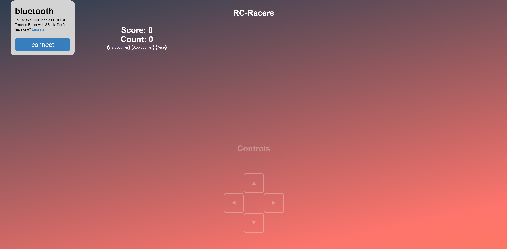
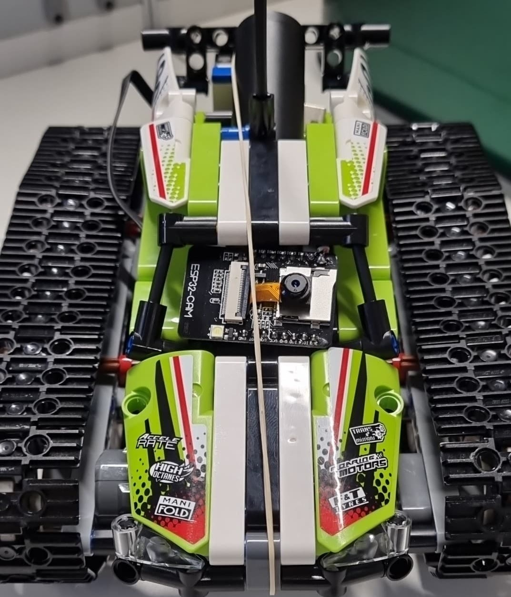

# PROJECTS – LEGO BATTLE TANKS

## Goal

- Control the Lego RC Tanks using the S-Brick via Bluetooth
- Race against other teams
- ( make noise when you have driven through heckpoint.)

## Current progress

- webpage with:
  - controls
  - scoreboard

  - live POV feed 

- assembled starting checkpoint

## Materials

- Lego RC Tank
- Controlled via S-Brick (Bluetooth)
- Using arduino LCD to measure speed.
- NFC: to activate checkpoints.
- Using light sensor for start/stop

## Members

- Aaron Degroote
- Mark De Craemere
- Matias Vereecke
- Arthur Coupé

## Extra's

- a gun to shoot targets.
